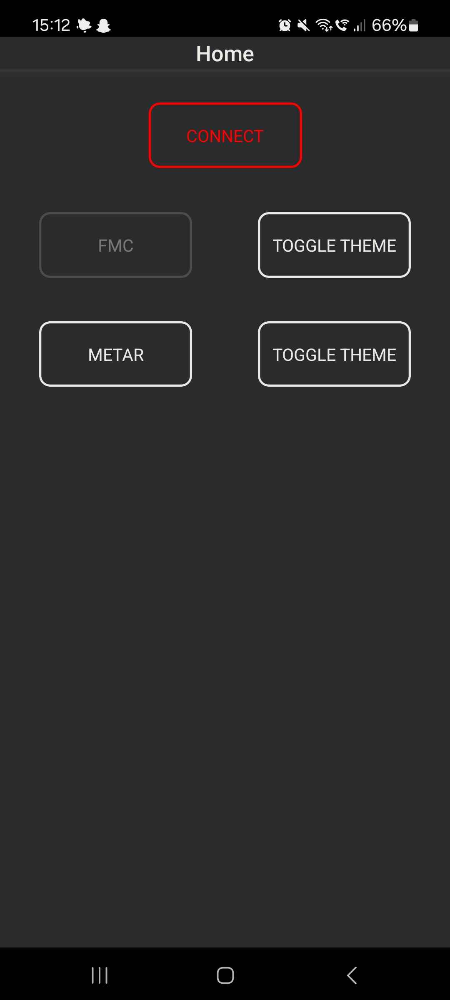
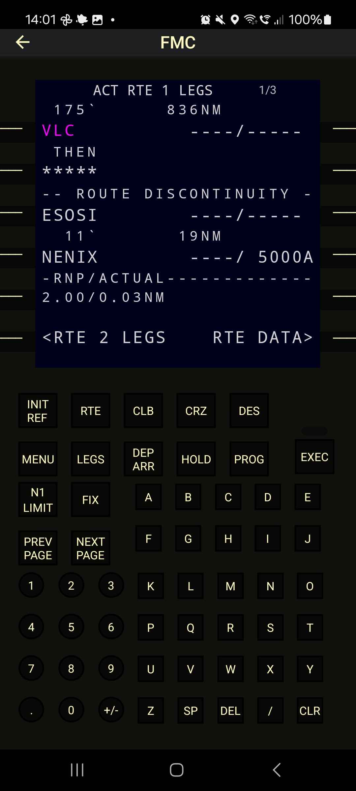
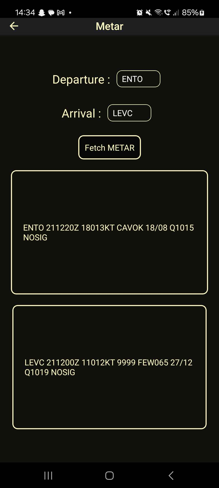

Features:
- Mobile version of the FMC (brain of the aircraft)
- Plugin to install in X-plane 11
- Easy setup for mobile to simulator
- METAR lookup (not yet fully supported)
- Android-tested. IOS version might contain bugs.
- Day/night themes

Installation:

- Download xp11Plugin/plugin and add 'simData' into your xp11 plugins-folder
- Download and install the app APK onto your android or IOS device.

Preview:

Appearance in simulator:

Home screen:

FMC screen in flight: 

METAR screen: 

